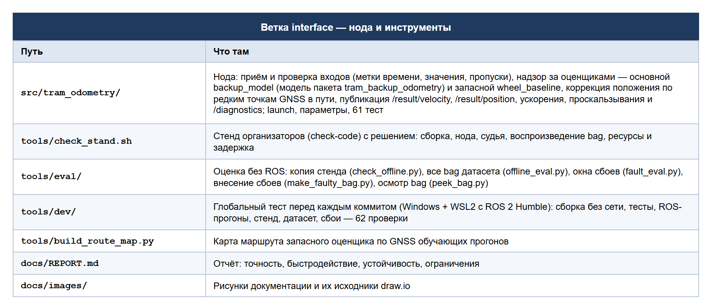

# Резервная одометрия трамвая — ветка `interface`

Ветка разработки ROS 2 ноды `tram_odometry` и инструментов проверки.

**Итоговое решение для жюри — в ветке [`main`](https://github.com/KroLor/tram-backup-odometry/tree/main)**:
там нода из этой ветки и модель движения из ветки
[`algorithm`](https://github.com/KroLor/tram-backup-odometry/tree/algorithm), инструкция по сборке
и запуску, описание модели и отчёт о точности.

## Что в ветке



## Как ветка связана с остальными

- Пакета модели `tram_backup_odometry` здесь нет — он в ветке `algorithm`. Без него нода запускается
  на запасном оценщике `wheel_baseline` (с сообщением в логе). Глобальный тест сам берёт пакет модели
  из ветки `algorithm`, то есть проверяет ровно то, что получится в `main`.
- Изменения ноды делаются здесь и после зелёного глобального теста сливаются в `main`.

## Проверка в этой ветке

```bash
python tools/dev/global_test.py        # из корня репозитория, Windows + WSL2 Ubuntu-22.04 с ROS 2 Humble
python tools/eval/check_offline.py     # копия стенда без ROS (нужен пакет модели на PYTHONPATH)
```

Коммит — только если глобальный тест закончился строкой «ВСЁ PASS».
