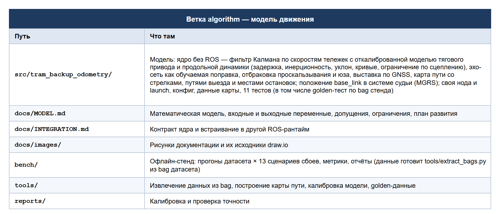

# Резервная одометрия трамвая — ветка `algorithm`

Ветка разработки модели движения трамвая — ROS 2 пакета `tram_backup_odometry`.

**Итоговое решение для жюри — в ветке [`main`](https://github.com/KroLor/tram-backup-odometry/tree/main)**:
нода `tram_odometry` из ветки [`interface`](https://github.com/KroLor/tram-backup-odometry/tree/interface)
использует эту модель как основной оценщик.

## Что в ветке



## Проверка

```bash
cd src/tram_backup_odometry
python3 -m pytest -q test      # 11 тестов, нужен numpy; ~4 с
```

Сборка и запуск ноды модели — [`src/tram_backup_odometry/README.md`](src/tram_backup_odometry/README.md).
Пакет сообщений `tram_vehicle_msgs` берётся у организаторов. При осознанном изменении ядра
golden-данные пересоздаются по [`docs/INTEGRATION.md`](docs/INTEGRATION.md), §5.
