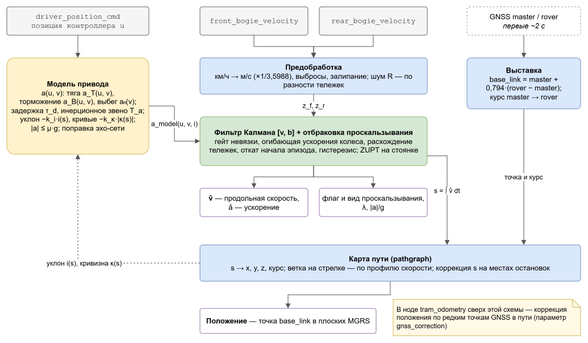

# Математическая модель и алгоритм оценки

## 1. Структура



> В ноде жюри `tram_odometry` модель работает внутри оценщика `backup_model`. Сверх схемы нода уточняет
> место на карте по редким точкам GNSS в середине маршрута (ТЗ допускает GNSS «для начальной выставки
> и коррекции»; выключается `gnss_correction:=false`). Выходы ноды жюри: `/result/velocity`,
> `/result/position`, `/result/acceleration`, `/result/slip_detected`, `/result/slip_ratio`; момент
> на валу, обороты, использованное сцепление, место на карте и WGS-84 — в `/diagnostics` (статус
> «оценщик»). Параметры модели там задаются как `model.*` в `src/tram_odometry/config/params.yaml`.

### 1a. Входные и выходные переменные

| Величина | Обозначение | Единицы | Откуда / куда |
|---|---|---|---|
| Позиция контроллера | u ∈ {−15…+15} | — | `/vehicle/driver_position_cmd` |
| Скорости тележек | z_f, z_r | м/с (показание в км/ч × 1/3,5988) | `/vehicle/front_bogie_velocity`, `/vehicle/rear_bogie_velocity` |
| Точки GNSS | широта, долгота, высота, статус | °, м | `/sensing/gnss/{master,rover}/fix`: выставка; в ноде жюри — и коррекция |
| Параметры модели | таблица a(u, v), τ_d, T_a, k_i, k_κ, μ, веса эхо-сети, карта пути | — | `config/model.json`, `config/esn.json`, `data/*.json`, `Params` |
| Состояние | v, b; a_f — выход инерционного звена; s — путь; место на карте | м/с, м/с², м | внутреннее |
| Скорость | v̂ | м/с | `/result/velocity`, `twist.twist.linear.x` |
| Ускорение | â | м/с² | `/result/acceleration` |
| Положение и курс | x, y, z — base_link в плоских MGRS; ψ | м, рад | `/result/position` |
| Неопределённость | σ вдоль и поперёк пути, дисперсия v̂ | м, (м/с)² | ковариации `Odometry` |
| Проскальзывание | флаг и вид; λ = (z − v̂)/max(v̂, 1); \|a\|/g | — | флаг, скольжение, диагностика |
| Привод | a_привод, M_вал, ω_вал | м/с², Н·м, об/мин | диагностика |

## 2. Модель тягового привода

Позиция контроллера u ∈ {−15…+15} задаёт установившееся удельное ускорение, приведённое к нулевому уклону:

- **тяга (u > 0)** — таблично-аппроксимирующая характеристика a_T(u, v). На малой скорости она почти постоянна
  (ограничение тока/сцепления, до 1.13 м/с² на u=15). С ростом скорости снижается, как при ограничении мощности;
- **торможение (u < 0)** — разделимая модель a_B(u, v) = a₀(v) + B(u)·φ(v):
  - B(u) — уровень торможения позиции, монотонный, от −0.25 (u=−1) до −1.5…−1.6 м/с² (u=−15);
  - φ(v) — затухание электродинамического торможения на малой скорости;
- **выбег (u = 0)** — a₀(v) ≈ −0.02…−0.07 м/с², основное сопротивление движению;
- **позиция −8 двузначна**. При углублении торможения (со стороны −7) это обычная тормозная ступень.
  При отпуске тормоза (со стороны −9…−15) это режим, близкий к выбегу: −0.06…−0.15 м/с². Модель различает
  режимы по истории команд.

Динамика привода: транспортная задержка τ_d и инерционное звено первого порядка.

```
a_ss(t) = a_drive(u(t − τ_d), v) − k_i · i(s)
T_a · da/dt + a = a_ss            T_a = 0.3 с, τ_d ≈ 0…0.1 с
```

### 2a. Момент на валу двигателя и переход «момент → скорость»

Табличная характеристика даёт удельную силу привода a_привод(u, v) = a_drive(u, v) − a₀(v) (м/с² ≡ Н/кг),
то есть тягу или тормозную силу без сопротивлений. Переход к моменту и обратно:

```
F_колесо = m·(1+γ)·a_привод                  сила на ободе колёс, Н
M_вал    = F_колесо·r / (i·η·n_дв)            момент на валу двигателя, Н·м (при торможении η → 1/η)
ω_вал    = v·i / r                            угловая скорость вала, рад/с
a        = M_вал·i·η·n_дв / (r·m·(1+γ)) − сопротивления      обратный переход: момент → ускорение → v
```

- γ ≈ 0.26 — коэффициент инерции вращающихся масс, получен из данных: k_i = g/(1+γ) = 7.8;
- масса m, радиус колеса r, передаточное отношение i, КПД η, число двигателей n_дв — параметры
  (`mass_kg`, `wheel_radius_m`, `gear_ratio`, `drive_efficiency`, `n_motors`).

Массу по данным определить нельзя: она входит только в пересчёт в момент. Оценки скорости и положения
от этих параметров не зависят: модель работает в удельных силах. Момент и обороты вала публикуются
в диагностике: у ноды модели — `/result/diagnostics` (`motor_torque_nm`, `motor_shaft_rpm`), у ноды
жюри `tram_odometry` — `/diagnostics`, статус «оценщик».

## 3. Модель продольной динамики

Модель записана в удельных силах (м/с² ≡ Н/кг), потому что массу по данным определить нельзя:

```
dv/dt = a(t) + b,       ds/dt = v · k_s
```

- a — ускорение модели привода. В нём учтены:
  - основное сопротивление движению (качение, аэродинамика, потери) — через a₀(v);
  - уклон пути −k_i·i(s), где i(s) берётся из карты. Идентифицированный k_i = 7.8 м/с² соответствует g/(1+γ),
    γ ≈ 0.26 — инерция вращающихся масс;
  - **сопротивление на кривых** −k_κ·|κ(s)|, где κ = 1/R — кривизна из карты. По данным k_κ = 3.55 м/с²·м,
    то есть w_r = 362/R Н/кН. На радиусах < 30 м остаток физики без этого члена был −0.10 м/с²;
  - **ограничение по сцеплению** |a| ≤ μ·g, μ = 0.3 (параметр `adhesion_mu`);
- b — медленное смещение модели. По умолчанию отключено: на стенде оно ухудшало положение
  (without-ESN и with-ESN). Роль адаптации к прогону выполняет ESN с онлайн-контекстом;
- k_s — масштаб пути, 1.0002 по калибровке. В работе адаптируется по коррекциям на остановках в пределах ±1.5 %.

Параметры идентифицированы офлайн на 79 обучающих уникальных прогонах (`tools/calibrate.py`,
`reports/calibration.md`). Модель ускорения даёт R² = 0.91, СКО остатка 0.17 м/с².
Задержка и инерционность подобраны перебором по R² прямого прогона модели.

## 3a. Эхо-сеть (ESN) — обучаемая часть модели динамики

**Зачем.** Физическая модель (раздел 2) объясняет ускорение с R² ≈ 0.91. Когда колёсам верить нельзя
(пропадание, боксование, юз, залипание), скорость держится только на модели, и её ошибка накапливается.
ESN уменьшает эту ошибку и работает в фильтре на каждом шаге.

**Устройство** (`esn.py`, веса `config/esn.json`):
- резервуар 200 нейронов, сетка 10 Гц, утечка 0.05, спектральный радиус 0.8;
- **вход резервуара:** история позиций контроллера (режим, знак, изменение за 1 с) и уклона пути; пока колёса
  достоверны — ещё измеренный остаток физики (ускорение по колёсам − физика, центральная разность ±0.5 с
  с задержкой 0.5 с) и флаг «колёса есть». Это **память о текущем прогоне**, которую сеть уносит в провал;
- **контекст прогона:** онлайн-МНК (забывание ~200 с) множителей физики — тяга, торможение, выбег, смещение.
  Он подаётся в выходной слой;
- **выход — физически осмысленная поправка:** множители к тяговой и тормозной составляющей и добавка к ускорению:
  a = (1 + k_T + ESN_T)·a_тяги + (1 + k_B + ESN_B)·a_торм + (1 + k_0)·a_выбег + … + ESN_add;
- поправка применяется **в режиме «колёсам не верим»**, для него сеть и обучена. Резервуар и контекст
  обновляются всегда, чтобы к началу провала была память.

**Обучение — многошаговое в замкнутом контуре** (`bench/esn_v2.py`, PyTorch на GPU):
- окна «без колёс» по 30 с (35 тыс. окон на train);
- через развёртку модели v ← v + dt·(a_физ + ESN) градиент идёт к выходному слою;
- потери — ошибка скорости и пути на каждом шаге, нормированная на ошибку физики на этом шаге, чтобы первые
  секунды не тонули;
- старт весов — ноль (= физика), ранняя остановка по внутренней валидации.

Обучение на один шаг не работает: сеть учится дифференцировать историю измеренной скорости, а в провале
разваливается. Это проверено.

**Результат (val, прогноз без колёс, 17 прогонов, 676 стартов; скорость, м/с / путь, м):**

| горизонт | физика | физика, дообученная многошагово (контроль) | физика + ESN |
|---|---|---|---|
| 5 с | 0.462 / 1.06 | 0.470 / 1.08 | 0.462 / 1.04 |
| 10 с | 0.642 / 3.56 | 0.640 / 3.59 | **0.598 / 3.44** |
| 30 с | 1.018 / 17.7 | 0.978 / 17.1 | **0.867 / 15.0** |
| 60 с | 1.077 / 41.6 | 1.051 / 40.2 | **0.940 / 34.3** |

Абляции на 30 с, скорость / путь:
- без памяти: 0.897 / 15.9;
- без контекста: 0.979 / 17.0;
- контекст, вставленный прямо в физику без сети: 1.081 / 18.3, хуже физики. Сеть научилась использовать
  контекст выборочно, а напрямую он вредит.

В оценщике (стенд, 13 сценариев, медианы) против контроля «без ESN»:
- ошибка скорости в окне сбоя при пропадании колёс 2×30 с: 0.425 → **0.292 м/с (−31 %)**;
- при пропадании 2×10 с: −16 %;
- при залипании и юзе: −10 %;
- без сбоев результат не хуже.

## 4. Фильтр скорости и учёт проскальзывания

Фильтр Калмана с состоянием x = [v, b]:
- прогноз — по модели выше с шагом ≤ 50 мс;
- коррекция — показаниями тележек: z = показание × 1/3.5988, потому что датчики выдают км/ч.

Шум измерения R оценивается онлайн как половина дисперсии разности тележек (R ≥ 0.05² м²/с²).

Отбраковка показаний (каждой тележки отдельно):

| Признак | Условие | Вывод |
|---|---|---|
| недостоверное значение | NaN/inf, < −0.5 или > 25 м/с | `invalid` |
| залипание | ≥ 5 одинаковых показаний подряд при v > 1 м/с (в реальных данных максимум 4) | `frozen` |
| одиночный скачок | \|z − z_пред\| > 3 м/с²·Δt + гейт | `spike` |
| невязка | \|z − v̂\| > max(3√S, 0.35 м/с) | `slip` при тяге и z > v̂, `slide` (юз) при торможении и z < v̂, иначе `outlier` |
| ускорение колеса вне физической огибающей | dz/dt (окно 0.4 с) вне [макс. торможение − 0.5; макс. тяга + 0.5] при данной скорости для **любой** позиции контроллера | `slip` / `slide`, эпизод «подтверждён» |
| расхождение тележек | \|z_f − z_r\| > max(0.5 м/с, 4√(2R)) | недостоверна тележка, дальше от прогноза |

При подтверждённом эпизоде:
- **откат** — первые показания эпизода успели пройти гейт, поэтому скорость восстанавливается из оценки
  0.35–0.6 с назад плюс прогноз модели;
- **заморозка b** — смещение модели не подстраивается по подозрительным данным;
- **гистерезис выхода** — тележка снова принимается, только когда ускорение её колеса 0.5 с согласуется с моделью.
  Иначе был бы принят «хвост» эпизода.

Невязка, которая физически не может быть проскальзыванием (`outlier`: колесо быстрее модели без тяги или медленнее
без торможения), при согласованных тележках и ускорении в пределах огибающей означает ошибку модели или команды
контроллера. В данных есть такой случай: трамвай разгоняется при тормозных позициях. Тогда колёса принимаются
снова через 1 с.

Пока обе тележки недостоверны, скорость считается **только по модели**. Если обе тележки 3 с и дольше стабильно
расходятся с моделью (невязка не меняется, то есть это ошибка модели, а не проскальзывание), либо 8 с и дольше
в любом случае, выполняется ресинхронизация по колёсам.

ZUPT (обнуление скорости на стоянке): тяги нет, и показания за 1 с в пределах шума → v = 0.

Публикуются:
- флаг проскальзывания и его вид;
- коэффициент продольного скольжения колеса λ = (z − v̂)/max(v̂, 1);
- использованное сцепление |a|/g.

### 4a. Альтернатива: IMM из трёх UKF (параметр `filter: imm`, `imm.py`)

Режимы — норма, боксование и юз обеих тележек. Каждый режим — UKF с состоянием [v, a_f]: сигма-точки
проходят через нелинейную модель привода и ESN.

Измерение в каждом режиме:
- норма — обычное измерение;
- боксование — колесо даёт верхнюю границу скорости (усечённое нормальное распределение);
- юз — колесо даёт нижнюю границу.

Правдоподобия режимов — скошенное нормальное распределение. Выход ускорения колеса за огибающую — свидетельство.
Вероятности перехода зависят от режима управления: боксование вероятно при тяге, юз — при торможении.

Сравнение на стенде (val, медианы, скорость в окне сбоя):

| сценарий | KF + ESN | IMM + ESN |
|---|---|---|
| смешанный | 0.265 | **0.213** |
| залипание | 0.235 | **0.222** |
| боксование | **0.193** | 0.198 |
| без сбоев | **0.033** | 0.035 |
| выбросы | **0.035** | 0.045 |

Обнаружение боксования: IMM 100 %, KF 83 %. Основным выбран KF: скорость без сбоев весит больше всего.
IMM оставлен опцией.

## 5. Положение

- **Точка выхода — base_link**: ось вращения первой тележки на уровне рельса. tf антенн от организаторов:
  master (−9.873; 0; 3.0), rover (2.563; 0; 3.0).
- **Выставка.** По GNSS первых ~2 с: base_link = master + 0.794·(rover − master), по высоте −3.0 м.
  Курс — направление master→rover, поэтому он известен и на стоянке. Если у master нет решения status=2,
  а у rover есть, base_link берётся по rover со сдвигом −2.563 м вдоль пути. Исключение: rover на стоянке
  «гуляет» заметно сильнее master (разброс > max(0.2 м, 3× master), многолучёвость у депо). Тогда статус
  не гарантирует точности, берётся master. На bag стенда организаторов это −2.4 м вдоль пути на старте.
- **Карта пути** — pathgraph: 49 рёбер, 12.8 км, шаг 1 м. Геометрия рельсового пути, высоты уровня рельса,
  места остановок пересчитаны для base_link. На основной линии совпадает с картой организаторов:
  поперечно −0.02 м, по высоте +0.1 м. Высоты и уклоны из GNSS. Положение = точка на рёбрах по дуговой координате s.
- **Плановая геометрия — по траекториям base_link** (`tools/refine_geometry_base_link.py`). Антенна master стоит
  на кузове за задней тележкой (свес) и на кривых выносится наружу. Линия, подогнанная к master, на R ≈ 20 м
  (депо, кольца) длиннее рельса на 3–4 %. base_link = master + 0.794·(rover − master) лежит на оси кузова над
  первой тележкой, то есть на рельсе. По 400 тыс. таких точек (оба фикса status=2, база 12.44 ± 0.5 м) ребра
  сдвинуты поперёк: сдвиг до 1.5 м, сглаживание σ = 8 м. Профиль пересэмплирован с шагом 1 м по длине
  **в честной ENU**. Прежняя длина считалась в равнопромежуточной проекции на сфере и была занижена на 0.23 %
  (≈ 12 м на 5 км). Итог — ошибка вдоль пути без сбоев на val 1.93 → 1.22 м.
- **Стрелки.** По умолчанию преемник выбирается среди топологически связных рёбер по плотности проездов
  (GNSS-проходов на метр). Там, где трамвай иногда уходит на редкую ветку (заезд в депо: две стрелки подряд,
  6/47 и 26/48), ветка уточняется **по профилю скорости после стрелки** (`tools/build_branch_profiles.py`,
  `data/branch_profiles.json`):
  - по train-прогонам для каждой ветки — медиана и разброс скорости колёс через каждые 2 м на 60 м после узла.
    Разброс не меньше max(0.5 м/с, 15 % скорости) с поправкой на малую выборку √(1 + 3/n);
  - онлайн оценщик сравнивает свою скорость с профилями веток (робастное правдоподобие: вклад бина ограничен)
    только на бинах, где профили различаются (разница медиан ≥ разброса);
  - решение принимается не раньше 30 м после узла. Переустановка на другую ветку — при перевесе
    логарифма правдоподобия ≥ 6 и при условии, что профиль этой ветки действительно описывает движение
    (средний z² ≤ 3). Остановка сразу после стрелки не похожа ни на одну ветку и перевеса не даёт;
  - вложенная стрелка на новой ветке решается сразу по уже накопленной скорости;
  - стрелка берётся в пакет, только если выбор по профилю на train (leave-one-out) точнее выбора по плотности:
    6/47 — 1.00 против 0.85, 26/48 — 0.95 против 0.81.

  Физический смысл: на основной ветке за стрелкой ограничение скорости (провал до 2 м/с, дальше ≤ 3.6 м/с),
  на заезде в депо водитель разгоняется до 5–7 м/с. На bag стенда организаторов это убрало уход на 48 м
  в конце прогона.
- **Коррекция на остановках.** Трамвай останавливается на станциях и у стоп-линий с межквартильным размахом ≤ 1 м.
  При стоянке ≥ 1 с рядом с известным местом остановки (окно ±3σ, 10–40 м) s корректируется
  калмановским шагом (σ = 1.5 м), по серии коррекций уточняется масштаб колёс.
- **Окно поиска остановки** не больше 30 м, это около длины вагона. Иначе стоянка в очереди за другим трамваем
  притягивалась бы к платформе.
- **Старт вне карты** (разворотное кольцо, отстойный путь): положение по известному пути выезда из данных
  (`tools/build_approach.py`) до точки въезда на карту. Если у master нет решения status=2, к карте
  привязывается rover.
- **Система координат** — плоские MGRS, как у судьи: x = UTM 37N восток − 300 000, y = север − 6 100 000,
  z — эллипсоидальная высота. Проекция Гаусса–Крюгера (ряды Крюгера) реализована в пакете, расхождение с pyproj < 0.1 мм.
- **Уклон** берётся под антенной master (9.87 м позади base_link, около середины вагона): сила тяжести
  действует на весь вагон. Под передней тележкой калибровка хуже (R² 0.901 против 0.909).

## 5a. Представления положения

- **Основное** — плоские координаты MGRS судьи (`/result/position`; у ноды модели ещё `/result/geo`,
  у ноды жюри WGS-84 — в `/diagnostics`).
- **По карте pathgraph** — ребро и координата вдоль него (`map_edge`, `map_s_m`) и пройденная дистанция
  (`distance_m`), все в диагностике (`/result/diagnostics` ноды модели, `/diagnostics` ноды жюри).
- **Инициализация:**
  - по GNSS первых секунд;
  - без GNSS — по заданной начальной позиции (`init_x`, `init_y`, `init_yaw`; в ноде жюри — `model.init_x`,
    `model.init_y`, `model.init_yaw`), то есть последней известной
    до отказа навигации или стартовой точке;
  - если ничего не задано — относительная одометрия от стартовой точки.

## 6. Допущения

1. Колёса датчиков скорости не буксуют постоянно. Проскальзывание — эпизоды секундами, а не минутами.
2. Трамвай движется по рельсам карты, реверса нет (все рёбра однонаправленные).
3. Первые ~2 с прогона есть GNSS (по ТЗ), трамвай в это время на карте.
4. Характеристика привода одинакова для обоих вагонов (30618, 30639); масштаб колёс различается на 0.2 %,
   это покрывает адаптация.
5. Масса, загрузка и погода неизвестны. Их влияние на ускорение сводится к медленному смещению b,
   а на путь — к масштабу k_s.

## 7. Ограничения

- **Стрелки без характерного профиля скорости.** Выбор по профилю работает там, где ветки различаются
  скоростным режимом (заезд в депо). На остальных стрелках — ветка с наибольшей плотностью проездов.
  Если трамвай уходит на редкую ветку без отличий в скорости, положение до следующей известной остановки
  идёт по основной ветке. На заезде в депо положение до решения (30–36 м после стрелки) идёт по основной
  ветке, поперечная ошибка там до 12 м.
- **Масштаб колёс конкретного прогона** может отличаться на 0.5–1 %. Между остановками это даёт дрейф
  до 0.5–1 % пройденного, на остановках он снимается.
- Долгое пропадание обеих тележек (десятки секунд): ошибка скорости ≈ 0.4 м/с за 30 с, пути — до ~15 м.
- При отсутствии GNSS в начале публикуется относительная одометрия, а не координаты в системе эталона.
- В 2 из 77 прогонов с GNSS сам GNSS-эталон смещён на 10–20 м параллельно пути на значительной части маршрута
  (`30639_253671cc`, `30639_9c362687`). Решение выдаёт положение на пути, и против такого эталона остаётся
  постоянная ошибка.
- Старт в местах, которых нет ни в карте, ни в путях выезда (депо в 350–390 м от линии), даёт прямолинейное
  счисление или относительную одометрию.

## 8. План развития после хакатона

1. **Карта и стрелки.**
   - Полная карта депо, разворотных колец и съездов от организаторов.
   - Определение ветки на остальных стрелках: места остановок, сравнение прогноза модели на обеих ветках
     (уклон, кривизна), многогипотезное сопровождение положения. Скоростной режим уже используется.
2. **Больше данных для обучаемой части.**
   - Переобучение ESN на всех прогонах, включая новые и зимние.
   - Разметка реальных эпизодов проскальзывания (сейчас их мало, сценарии сбоев частично синтетические).
3. **Идентификация параметров вагона.**
   - Масса и загрузка по данным системы управления (ток или момент двигателей, если станут доступны).
   - Износ колёс: онлайн-калибровка радиуса по местам остановок уже есть, нужно долгосрочное хранение
     между поездками.
4. **Фильтр.**
   - Гибрид: KF для отбраковки + вероятности режимов IMM для флага проскальзывания.
   - Сопровождение нескольких гипотез положения на стрелках.
5. **Производительность.** Перенос ядра на C++ (rclcpp) для бортовых вычислителей. Сейчас Python:
   ~0.1 мс на сообщение, запас по задержке в сотни раз.
6. **Интеграция.** Публикация `diagnostic_msgs` в общую диагностику, tf `map → base_link`, переход
   в резервный режим по сигналу потери GNSS в основном контуре.
