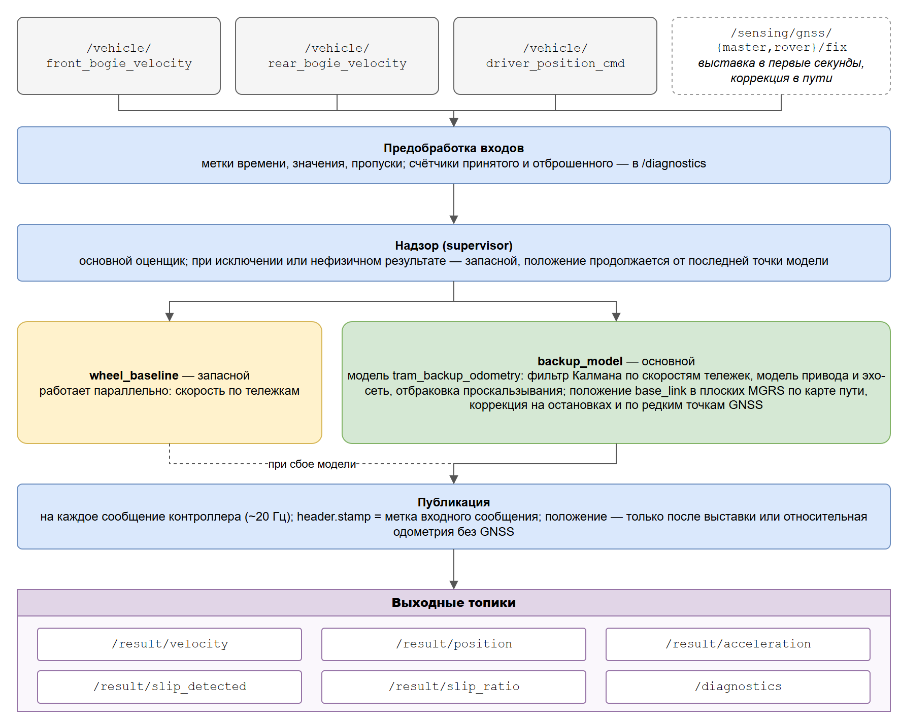

# Отчёт: резервная одометрия трамвая по модели — точность, быстродействие, ограничения

27.09.2026. Решение — два пакета ROS 2 Humble: нода `tram_odometry` (приём и проверка входов,
надзор за оценщиками, публикация результата, диагностика) и модель движения `tram_backup_odometry`.

## 1. Итог

Официальный стенд организаторов (`check-code`: `hackathon_solution_checker`, bag `30618_88aea4d9` —
1309 с, 5,5 км; ROS 2 Humble, воспроизведение ×1; сопоставление с `/localization/kinematic_state`
по метке ±0,05 с):

| Вариант | Скорость RMSE / max, м/с | Положение 3D RMSE / max, м | x / y / z RMSE, м | n |
|---|---|---|---|---|
| **Итог: нода `tram_odometry` + модель + коррекция по GNSS в пути** | **0,051 / 0,98** | **1,209 / 11,50** | 0,944 / 0,742 / 0,137 | 26 210 |
| Модель `tram_backup_odometry` отдельно (её нода) | 0,057 / 1,20 | 1,772 / 14,19 | 1,301 / 1,193 / 0,165 | 38 318 |
| Нода с простым оценщиком `wheel_baseline` (интеграл скорости тележек; офлайн-копия стенда) | 0,050 / 0,32 | 134 715 (положение в локальной ENU, а не в системе судьи) | — | 26 211 |

Ресурсы на стенде (итоговая версия): CPU 3,9 % одного ядра в среднем за прогон, память (RSS)
до 70 МБ без роста, задержка «вход → результат» p50 0,9 мс, p99 до 2,3 мс, максимум 2,3 мс;
частота `/result/velocity` и `/result/position` — 20,0 Гц; ошибок в логе ноды нет.

Главное:
- Положение — в системе координат судьи (плоские MGRS, точка base_link). Простой оценщик
  `wheel_baseline` даёт локальную ENU от первой точки GNSS для антенны master — у судьи это ошибка
  ~135 км, поэтому он оставлен только запасным.
- Коррекция по редким точкам GNSS в пути (в bag стенда — всплески по 1–3 с раз в 2–3 мин;
  ТЗ допускает GNSS для коррекции) снизила 3D RMSE на 32 % (1,77 → 1,21 м), ошибку
  в конце — с 6,2 до 0,14 м и исправила выбор ветки у депо.
- Найдена и устранена перегрузка процессора: numpy через OpenBLAS раздавал даже операции
  над матрицами 2×2 потокам по числу ядер, и нода (как и нода модели отдельно) занимала
  7–8 ядер при лимите ТЗ в 2.
- Найдена и устранена потеря состояния модели на мусорных метках времени (нулевые, ±1 ч):
  модель принимала их за начало нового прогона и сбрасывалась, путь обнулялся.

## 2. Состав решения и инструменты

| Часть | Что входит |
|---|---|
| Пакеты ROS 2 | `src/tram_odometry` — нода для жюри: предобработка, оценщик `backup_model` (модель) под надзором с запасным `wheel_baseline`, коррекция по GNSS в пути, защита модели от мусорных меток, публикация и диагностика; `src/tram_backup_odometry` — модель движения (ядро без ROS, своя нода, карта пути, калибровка) |
| Инструменты оценки | `tools/check_stand.sh` — стенд организаторов «как у жюри» одной командой (сборка, нода, судья, запись, воспроизведение, CPU/RSS, задержка); `tools/eval/check_offline.py` — копия стенда без ROS за 6 с (совпадает со стендом: 1,222 против 1,209 м); `offline_eval.py` — все bag датасета, эталон — пара антенн в MGRS; `fault_eval.py` — окна сбоев; `make_faulty_bag.py` — 10 видов сбоев; `peek_bag.py`; замер задержки `monitor:=true` |
| Документы | README для жюри (сборка, запуск, топики, параметры, проверка, изменения файлов организаторов); этот отчёт; модель — `docs/MODEL.md`, встраивание — `docs/INTEGRATION.md`, валидация модели — `reports/` |
| Приёмка | 62 автоматические проверки перед каждым коммитом (сборка без сети, тесты, ROS-прогоны, стенд, датасет, сбои; `tools/dev/global_test.py` в ветке `interface`) — все пройдены; сборка из чистого клона репозитория в стенде организаторов без сети — 4 пакета, все тесты без ошибок |

## 3. Как устроено решение

**Модель** (подробно — `docs/MODEL.md`): фильтр Калмана по состоянию [v, b]; прогноз — откалиброванная
тяговая и тормозная характеристика a(позиция контроллера, скорость) с задержкой, инерционным звеном,
уклоном и сопротивлением на кривых (по карте), ограничением по сцеплению и эхо-сетью (ESN) как
обучаемой поправкой; коррекция — показания тележек (км/ч → м/с) с отбраковкой: гейт по невязке,
физическая огибающая ускорения колеса, залипание, скачки, расхождение тележек, откат начала эпизода
проскальзывания, гистерезис. Положение — пройденный путь по карте пути (`pathgraph.json`: линия,
разворотные кольца, съезды в депо) с выбором ветки на стрелке по профилю скорости, путями выезда
со стоянок вне линии и коррекцией на местах остановок (с адаптацией масштаба колёс).

**Интеграция по контракту модели** (`docs/INTEGRATION.md`): модель получает значения как в топиках
(скорость колёс в км/ч, позиция контроллера, фиксы GNSS со статусом) в порядке прихода, время —
только `header.stamp`. Тест `test_backup_model.py` прогоняет 50 848 входов bag стенда через ядро
ноды и сверяет скорость (±1e-6 м/с) и положение (±1e-4 м) с эталонными выходами самой модели —
встраивание не меняет расчёт. Модели передаются только сообщения, метки и значения которых прошли
предобработку ноды: иначе нулевая метка или метка на час вперёд сбрасывает модель.

**Коррекция по GNSS в пути** (`estimators/backup_model.py`): после выставки каждая точка со
status ≥ 2 сравнивается с положением той же антенны на карте (base_link на момент метки точки,
сдвинутый на смещение антенны вдоль вагона по tf организаторов). Невязка вдоль пути уточняет место
на карте фильтром Калмана (σ точки 1,5 м — как точность места остановки в модели; оптимум пологий:
при σ = 1,5…3 м RMSE 1,21–1,22 м); выбросы — по гейту 4σ. Если 5 точек подряд лежат в стороне
от пути, но на другой ветке карты, трамвай переставляется на неё. На стенде: 426 коррекций,
1 перестановка ветки (заезд в депо). Основание — ТЗ (PDF, «Модуль приёма и предобработки данных»):
GNSS-топики допускаются «для начальной выставки и коррекции»; в bag стенда такие точки в середине
маршрута действительно есть. Для строгого прочтения README датасета
(«GNSS — только эталон и начальная выставка») коррекция выключается: `gnss_correction:=false`
в launch — тогда 3D RMSE на офлайн-копии стенда 1,80 м вместо 1,22 м.

**Надзор**: при исключении, нечисловом или нефизичном результате модели выход берётся у
`wheel_baseline`, модель сбрасывается; положение продолжается по прямой от последней точки модели
по пути запасного оценщика; до выставки по GNSS положение не публикуется. Если GNSS в начале прогона
нет, через 15 с публикуется относительная одометрия от стартовой точки (x — пройденный путь,
y = z = 0), как допускает ТЗ; начальную позицию можно задать параметрами `model.init_x`,
`model.init_y`, `model.init_yaw`.

**Параметры и диагностика модели**: параметры модели (масса, радиус колеса, передаточное число, КПД,
сцепление, пороги отбраковки и проскальзывания, фильтр, начальная позиция) задаются в
`config/params.yaml` ноды как `model.*`. В `/diagnostics` (статус «оценщик») — режим положения,
удельная сила привода, момент и обороты вала двигателя, использованное сцепление |a|/g, вид
проскальзывания, сбой датчика, шум колёс, ребро и координата на карте пути, WGS-84, коррекции
по остановкам и GNSS.

## 4. Проверка

| Проверка | Результат |
|---|---|
| Модульные тесты (`colcon test`) | 72: 61 ноды + 11 модели (golden-тест модели, эквивалентность модели внутри ноды, относительная одометрия без GNSS, параметры модели) — 0 ошибок |
| Сборка «как у жюри» | чистый workspace, только ROS 2 Humble, без сети: `rosdep` — все зависимости есть; 3 пакета; тесты — PASS |
| Стенд организаторов (ROS, ×1) | см. раздел 1 |
| Копия стенда без ROS | скорость 0,049 м/с; 3D RMSE 1,222 м, max 11,5; вдоль пути RMSE 1,11 м (max 5,2), поперёк 0,50 м (max 10,7 — ~6 с на неверной ветке у депо до перестановки); ошибка в конце 0,14 м |
| Датасет: 78 прогонов с парой антенн (23,3 ч, 356 км), GNSS как на проверке (первые 30 с + всплески по 2 с раз в 150 с) | скорость: RMSE 0,149 м/с по всем точкам (медиана по прогонам 0,052; эталон — скорость GNSS, у двух прогонов он плохой), bias −0,002; положение 3D RMSE: медиана 1,42 м, p90 3,38 м; max — медиана 7,4 м; ошибка в конце / путь — медиана 0,015 %; сбоев модели 0 |
| GNSS только первые 5 с (прогон 40ffd323, 5,5 км, в ROS) | средняя ошибка положения 2,6 м, в конце 0,35 м |
| ROS-прогоны ×5/×10 | частота 19,9 Гц, выход на 99 % сообщений контроллера, метки строго растут, ERROR в диагностике нет |

**Устойчивость** — bag 30618_af7496f0 и его копия с 10 видами сбоев (офлайн, детерминированно;
наибольшее отличие скорости от прогона без сбоев):

| Сбой | Внутри окна, м/с | Через 5–10 с, м/с |
|---|---|---|
| front NaN, 5 с | 0,027 | 0,000 |
| rear всплески +40 км/ч, 20 с | 0,030 | 0,012 |
| колёса молчат, 3 с | 0,38 (модель без колёс) | 0,001 |
| контроллер молчит / дубли | 0,000 | 0,000 |
| front: нулевые метки | 0,000 | 0,012 |
| контроллер: метки ±1 ч | 0,012 | 0,029 |
| вне диапазона (ручка 99, 500 и −50 км/ч) | 0,031 | 0,000 |
| rear залип на 0, 20 с (манёвры у депо) | 1,009 | 0,312 |
| front inf | 0,000 | 0,000 |

Путь за прогон отличается от прогона без сбоев на −0,76 %. До защиты модели от мусорных меток было
6,7 м/с через 5 с после «±1 ч» и путь −100 %.

## 5. Изменения файлов организаторов

Изменены сами оригиналы, копий в репозитории нет (иначе рядом с пакетом стенда был бы дубликат
пакета, и colcon не собрал бы workspace). После правок пакеты датасета и стенда побайтно совпадают.

| Файл | Изменение | Причина |
|---|---|---|
| `Резервное позиционирование/tram_vehicle_msgs/package.xml` (датасет) | добавлен `<maintainer email="maintainer@example.com">Hackathon maintainers</maintainer>` — тот же тег, что у организаторов в `check-code` | без него `colcon build` в Humble: «Package 'tram_vehicle_msgs' must declare at least one maintainer» |
| `check-code/src/tram_vehicle_msgs/msg/DriverControllerCommand.msg`, `CMakeLists.txt` (стенд) | добавлено сообщение (из датасета) и его строка в `rosidl_generate_interfaces` | без этого типа в workspace стенда нет сообщения `DriverControllerCommand`, а значит и топика `/vehicle/driver_position_cmd`; тип взят из пакета датасета, где он есть |

Расхождение README датасета с данными: скорость колёс — в км/ч, а не в м/с.

## 6. Самооценка по критериям жюри

Критерии ТЗ; официальной формулы перевода метрик в баллы нет, оценка — наша.

| Критерий | Макс | Нода с `wheel_baseline` | Модель отдельно | **Итог** | Обоснование итога |
|---|---|---|---|---|---|
| 1. Точность скорости | 30 | 25 | 27 | **27** | RMSE 0,051 м/с на стенде, bias −0,002 м/с по 356 км; переходные режимы — модель с задержкой и инерционностью привода (RMSE на разгоне/торможении 0,039 м/с по данным модели); max 1,0 м/с; на исправных колёсах не лучше простого `wheel_baseline` |
| 2. Точность положения | 35 | 3 | 27 | **31** | 3D RMSE 1,21 м на 5,5 км (стенд организаторов), в конце 0,14 м (0,003 % пути), вдоль пути RMSE 1,1 м; система координат судьи; `Odometry` заполнен полностью (метка входа, `map`/`base_link`, скорость, ковариации вдоль/поперёк пути). Минус: ~6 с на неверной ветке у депо (max 11,5 м); без GNSS в пути ошибка больше (40ffd323: 2,6 м в среднем, до 14 м) |
| 3. Устойчивость, проскальзывание, аномалии | 20 | 16 | 14 | **17** | модель отбраковывает проскальзывание/юз и опирается на модель привода; сбои входов ≤ 0,03 м/с, восстановление; нода не падает, запасной оценщик; флаг и коэффициент проскальзывания, диагностика, адаптация масштаба колёс и ESN. Минус: датчик тележки, «залипший» на нуле при манёврах, — до 1 м/с на троганиях |
| 4. Реальное время | 15 | 14 | 8 | **15** | задержка p99 2,3 мс (≤ 100), 20 Гц (≥ 10, рекомендовано 20–50), CPU 3,9 % одного ядра и 70 МБ (≤ 2 ядра, ≤ 0,5 ГБ), память не растёт, сборка без интернета |
| **Итого** | **100** | **58** | **76** | **90** | |

«Модель отдельно» теряет баллы за перегрузку процессора (7 ядер из-за потоков BLAS) и сброс на
мусорных метках; «нода с `wheel_baseline`» — за систему координат положения, несовместимую с судьёй.

## 7. Ограничения и план развития

Ограничения:
- Точность положения зависит от GNSS в пути: без всплесков в середине маршрута остаются только
  коррекции на остановках (ошибка до ~14 м между ними). Без GNSS в начале прогона и без заданной
  начальной позиции публикуется относительная одометрия — не в системе координат судьи.
- На стрелках у депо ветка выбирается по профилю скорости после узла (от 30 м) или по точкам GNSS:
  несколько секунд положение может идти по соседнему пути.
- Отказ датчика тележки «ноль при движении» на малой скорости: модель на трогании верит модели
  привода и занижает скорость (до 1 м/с на ~3 с).
- Модель чувствительна к порядку сообщений разных топиков: в ROS результаты двух прогонов одного
  bag отличаются на доли м/с в отдельные моменты (DDS доставляет топики независимо).
- Трамвай 30639 (bag стенда — от трамвая 30618): на одном его прогоне положение уходит на 42 м.
- Python, один поток: ~0,35 мс процессорного времени на сообщение.

План развития:
- Многогипотезное сопровождение веток на стрелках (параллельные гипотезы до подтверждения).
- Адаптация масштаба колёс и параметров привода по точкам GNSS в пути, а не только по остановкам.
- Детектор отказа датчика тележки на малых скоростях и сопровождение по одной тележке.
- Буфер переупорядочивания входов по меткам (детерминированность в ROS).
- Перенос ядра на C++ (приёмка — тот же golden-тест).
